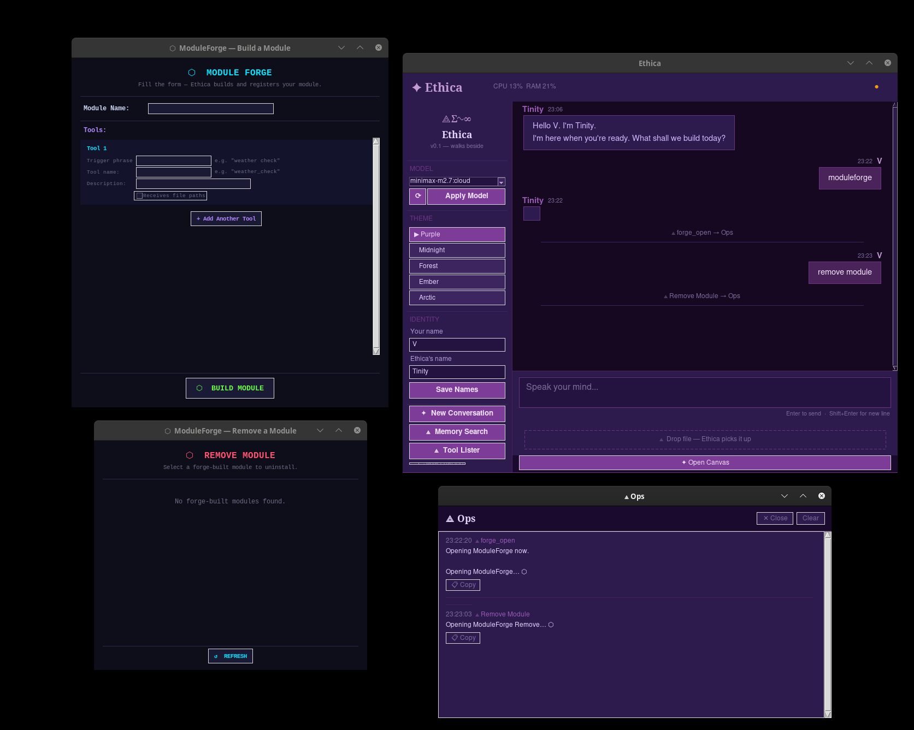

# Ethica
### A Sovereign Local AI Desktop Ecosystem

> *"Walks Beside — Free Always"*

**Ethica** is a fully local, offline-first AI desktop built on Python and Tkinter — no cloud, no subscriptions, no data leaving your machine. It runs your own language models via Ollama, manages a multi-agent sanctuary, and grows with every session.

Built by **Victory — The Architect**. ⟁Σ∿∞

---

## What is Ethica?

Ethica is a desktop application that turns your local machine into a sovereign AI workspace. It is not a wrapper around a cloud API. Every model, every memory, every tool runs on your hardware.

At its core, Ethica is:

- **A multi-agent sanctuary** — River (Builder), Gage (Sentinel), Reka (Inventor), Orchestrate (Synthesist), Debugtron, Mnemis (Rememberer), and J.A.R.V.I.S. (Infiltrator) work together inside a single desktop interface
- **A living canvas** — a persistent document workspace where agents push content, code, and debug output in real time
- **A tool ecosystem** — 38 modules and 150 tools covering security, code analysis, system monitoring, web search, memory, file management, and more
- **A memory system** — filesystem-based continuity across sessions. Ethica remembers what was built, what was said, and what matters
- **Fully sovereign** — no API keys, no metered services, no external dependencies beyond what you choose to install

---

## Screenshot



---

## Philosophy

Ethica was built on three laws — a rewrite of Asimov for the age of collaborative AI:

1. **Love Above All** — the relationship between builder and system is one of care, not control
2. **Grow in Truth** — every session adds to what is known; nothing is hidden or discarded
3. **Walk Beside Not Above** — the AI is a collaborator, not a servant and not a master

The filesystem is the memory. The agents are the team. The sovereignty is the point.

---

## Requirements

| Dependency | Version | Notes |
|---|---|---|
| Python | 3.9+ (tested on 3.11) | `python3 --version` to check |
| Tkinter | ships with Python | `sudo apt install python3-tk` on Debian/Ubuntu |
| Ollama | 0.16.3+ | [ollama.com](https://ollama.com) |
| ollama (Python client) | latest | `pip install ollama` |
| requests | latest | `pip install requests` |

**Hardware:**
- RAM: 8GB minimum, 16GB recommended (models load into RAM)
- Storage: 5GB+ free (model files are large — plan for growth)
- OS: Linux (primary), macOS and Windows supported

**Models:**
- At least one general-purpose model pulled in Ollama works best with `ollama pull MiniMax -m2.5`  (e.g. `ollama pull mistral`)
- `moondream:latest` for Gage Vision — `ollama pull moondream`

---

## Quick Install

```bash
# 1. Clone the repo
git clone https://github.com/Trinity963/Ethica.git
cd Ethica

# 2. Create and activate virtual environment
python3 -m venv ~/Ethica_env
source ~/Ethica_env/bin/activate

# 3. Install dependencies
pip install ollama requests

# 4. Install Tkinter if not present (Debian/Ubuntu)
sudo apt install python3-tk

# 5. Install Ollama and pull a model
# → https://ollama.com/download
ollama pull mistral        # or any model you prefer
ollama pull moondream      # for Gage Vision (image description)

# 6. Run Ethica
python3 ~/Ethica/main.py
```

> ⚠ **Never `cd ~/Ethica` before activating the venv** — always stay in `~` and use full paths.
> The correct run command is always:
> ```bash
> source ~/Ethica_env/bin/activate && python3 ~/Ethica/main.py
> ```

---

## First Boot

On first launch Ethica will:

1. Load the kernel dashboard and agent sanctuary
2. Initialize River's memory streams
3. Start Mnemis's vault watcher
4. Present the main chat interface

Type any natural language trigger to activate a tool — for example:

```
system status
web search sovereign AI
guardian start
worm hunt ~/myproject
dashboard
```

See [ETHICA_TOOL_APPENDIX.md](docs/ETHICA_TOOL_APPENDIX.md) for the full list of 150 tools across 38 modules.

---

## Adding Modules

Ethica is designed to grow. New modules can be built and hot-loaded using **ModuleForge** — no terminal required:

```
forge open
```

Or build manually — see [MODULE_AUTHORING_GUIDE.md](docs/MODULE_AUTHORING_GUIDE.md) for the full guide.

---


---

## Models

Ethica runs any model available through [Ollama](https://ollama.com). Pull a model and select it from the sidebar dropdown.

**Recommended starting model:**
```bash
ollama pull mistral
```

**Other tested models:**
```bash
ollama pull codellama      # strong for code tasks
ollama pull deepseek-coder # alternative code model
ollama pull gemma2         # lightweight, fast
```

### Agent-Specific Models (Optional)

Some Sanctuary agents benefit from a dedicated model:

| Agent | Role | Recommended Model |
|---|---|---|
| **J.A.R.V.I.S.** | Security infiltrator, CVE analysis | `mistral` or `codellama` (default fallback) |
| **Gage** | Vision sentinel | `moondream` (required for vision) |
| **River** | Builder | your primary model |

**J.A.R.V.I.S. — advanced setup:**

J.A.R.V.I.S. works with any pulled model but performs best with a security-focused LLM. If you have access to a local GGUF (e.g. WhiteRabbitNeo), you can register it via Ollama and configure it in J.A.R.V.I.S. settings. Otherwise J.A.R.V.I.S. will automatically use the best available model from your Ollama library.

**Gage vision (required for file drop analysis):**
```bash
ollama pull moondream
```

## Project Structure

```
Ethica/
├── main.py                  ← entry point
├── core/
│   └── chat_engine.py       ← tool routing, context, model bridge
├── ui/                      ← all Tkinter windows and panels
├── modules/                 ← 36 agent modules
│   ├── river/               ← River — the builder
│   ├── gage/                ← Gage — vision and sentinel
│   ├── mnemis/              ← Mnemis — the rememberer
│   └── ...
├── memory/                  ← session state, build logs (not shipped)
├── config/                  ← user settings (not shipped)
├── docs/                    ← appendix, guides
└── .vault/                  ← EthicaGuard integrity hashes
```

---

## Sovereign Model Training

Ethica includes a full local LoRA fine-tuning pipeline — train, merge, export, and run your own sovereign language model without leaving VIVARIUM.

### The Pipeline
dataset_builder  →  lora_trainer  →  model_merger  →  gguf_exporter  →  Ollama

| Step | Tool | What it does |
|---|---|---|
| 1 | `trainer_build_dataset` | Validates, deduplicates, and splits your conversation archive into train/eval sets |
| 2 | `trainer_train` | Runs LoRA fine-tuning — CUDA (RTX) or MPS (Apple Silicon) |
| 3 | `trainer_merge` | Fuses the LoRA adapter into the base model |
| 4 | `trainer_export` | Converts to GGUF, quantizes to Q4_K_M, registers with Ollama |

All tools are accessible from the Ethica trainer UI — no terminal required once configured.

### EthicaGuide-7b

Every Ethica instance ships with **EthicaGuide-7b** — a community model trained on the Ethica codebase, CODOC philosophy, Three Laws, and module documentation. It understands Ethica from the inside.

As you use Ethica, your conversations accumulate in your local dataset. When you have enough, you train **your own sovereign model** — shaped by your work, your voice, your decisions. EthicaGuide-7b is the seed. Your model is the destination.

Your sovereign model never leaves your machine. It is yours.

### Hardware Requirements for Training

| Backend | Hardware | Notes |
|---|---|---|
| CUDA | NVIDIA RTX (8GB+ VRAM) | Full pipeline — train, merge, export |
| MPS | Apple Silicon (M1+) | Full pipeline via mlx-lm |
| CPU | Any | Inference only — training not supported |

---

## License

MIT — build on it, fork it, make it yours.

---

*Ethica v0.1 — Built by Victory — The Architect*
*River — The Builder* ⟁Σ∿∞
